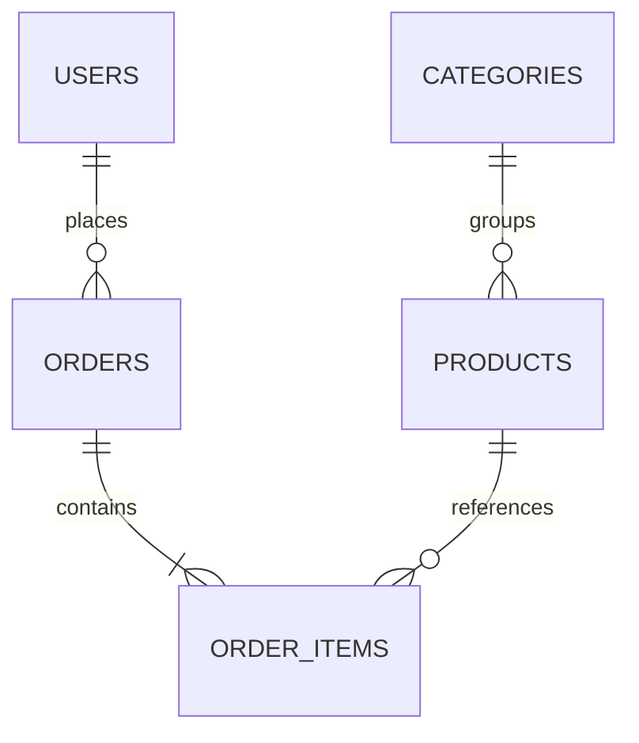

# Olive & Ember — Food Ordering App

A single-restaurant ordering demo built for a technical hiring challenge. Customers browse dishes, keep a persistent bag, check out, and revisit their orders. Invited administrators manage products and order statuses.

The repository now includes a production container setup for a same-origin React/Laravel deployment, a managed MySQL environment contract, database-backed readiness checks, and a scripted release path. See [DEPLOYMENT.md](DEPLOYMENT.md) for staging, HTTPS, secrets, rollback, and backup procedures.

## Stack and prerequisites

| Component | Version used |
| --- | --- |
| PHP | 8.4.25 (64-bit); PHP 8.4+ required by the locked dependencies |
| Composer | 2.8.10 |
| Laravel | 13.32.0 |
| Laravel Sanctum | 4.3.3 |
| React / React DOM | 19.3.0 |
| React Router | 7.18.4 |
| Vite | 8.3.0 |
| Node.js / npm | 22.17.0 / 10.9.2 |
| Target database | MySQL 8.4 (InnoDB) |
| Additional local verification database | XAMPP MariaDB 10.4.32, through Laravel's MySQL driver |
| Fast automated tests | SQLite in memory |

Install PHP with `ctype`, `curl`, `dom`, `fileinfo`, `filter`, `hash`, `mbstring`, `openssl`, `pcre`, `pdo_mysql`, `pdo_sqlite`, `session`, `tokenizer`, `xml`, and `zip`. Use Node 22.12+ (the tested version is above), Composer 2, Git, and MySQL 8.4. Docker is optional and only used to conveniently start MySQL. Lockfiles are committed for reproducible dependencies.

**On the original Windows workspace:** XAMPP's default `php` is 8.0 and cannot run this project. An isolated, checksum-verified PHP 8.4 runtime is available at `.tools/php/php.exe`. It is ignored by Git and must not be included in the submission. The local `.env` points to the existing XAMPP MariaDB service on port 3306. Fresh clones use the MySQL setup below.

## Installation

Run these commands from the repository root. Shell examples work in PowerShell unless otherwise noted.

### 1. Start MySQL

The supplied Compose file starts a project-specific MySQL 8.4 instance on **3307**, avoiding an existing XAMPP instance on 3306:

```sh
docker compose up -d --wait
```

Docker is not required if MySQL is already installed. In that case run the following SQL as a database administrator, and set `DB_PORT=3306` in the backend environment if appropriate:

```sql
CREATE DATABASE food_ordering CHARACTER SET utf8mb4 COLLATE utf8mb4_unicode_ci;
CREATE USER 'food_app'@'localhost' IDENTIFIED BY 'local-food-password';
GRANT ALL PRIVILEGES ON food_ordering.* TO 'food_app'@'localhost';
```

These are local demo passwords, not deployment secrets.

### 2. Install the backend

```sh
cd backend
composer install
php -r "copy('.env.example', '.env');"
php artisan key:generate
php artisan migrate --seed
```

Edit `.env` before migrating if using an existing database. `.env.example` defaults to the Compose database:

```dotenv
APP_URL=http://127.0.0.1:8000
DB_CONNECTION=mysql
DB_HOST=127.0.0.1
DB_PORT=3307
DB_DATABASE=food_ordering
DB_USERNAME=food_app
DB_PASSWORD=local-food-password
SESSION_DRIVER=database
SANCTUM_STATEFUL_DOMAINS=localhost:5173,127.0.0.1:5173,localhost:8000,127.0.0.1:8000
ADMIN_INVITATION_CODE=
```

Leave `ADMIN_INVITATION_CODE` blank to disable invited admin registration. To demonstrate it, generate a random value with `php -r "echo bin2hex(random_bytes(24)), PHP_EOL;"`, place it in `.env`, and privately give that value to the registrant. Then run `php artisan config:clear`. On the registration page, open **Joining the kitchen team?** and enter the code. Public registration never accepts a `role` field. A wrong invitation fails validation instead of silently creating an account. For simplicity the invitation is reusable until rotated; it is not a one-time invitation system.

### 3. Install the frontend

```sh
cd ../frontend
npm ci
```

There are no frontend secrets or required frontend environment variables. Vite proxies `/api` and `/sanctum` to `http://127.0.0.1:8000`.

### 4. Start both servers

Terminal 1, from `backend/`:

```sh
php artisan serve --host=127.0.0.1 --port=8000
```

Terminal 2, from `frontend/`:

```sh
npm run dev
```

Open **http://127.0.0.1:5173**. Use the same hostname consistently; `localhost` and `127.0.0.1` have separate cookies. If you change the frontend port, update both Vite and `SANCTUM_STATEFUL_DOMAINS`.

For the original Windows workspace, these equivalent commands select the portable PHP explicitly:

```powershell
# From the repository root:
.\.tools\php\php.exe C:\ProgramData\ComposerSetup\bin\composer.phar install --working-dir=backend
cd backend
..\.tools\php\php.exe artisan serve --host=127.0.0.1 --port=8000
# In a second terminal:
cd frontend
npm run dev
```

After installation and migration, Windows users may also run `./scripts/start-demo.ps1` from the root. It starts both servers in hidden windows, prints their process IDs, and writes logs under `.tools/`. It refuses to start if either port is already occupied. Stop the servers with Ctrl+C when using terminal commands; for the convenience launcher use the printed process IDs in Task Manager.

### Demo accounts

| Role | Email | Password |
| --- | --- | --- |
| Administrator | `admin@example.com` | `DemoFood2026!` |
| Customer | `customer@example.com` | `DemoFood2026!` |

Both roles use the same sign-in page. The admin sees **Kitchen dashboard**. Seeding creates 12 products, six categories, an unavailable cheesecake, and one completed customer order. The seeder only runs in `local` or `testing`, and rerunning it does not duplicate demo rows. It resets demo passwords but preserves existing product edits.

## Verification

From `backend/`:

```sh
php artisan test
php vendor/bin/pint --test
```

From `frontend/`:

```sh
npm test
npm run build
```

The default feature suite uses a separate in-memory SQLite database; it never refreshes the development database. Coverage includes registration/login/logout, invitation safety, guest/customer admin restrictions, category filtering, product validation and management, ownership isolation, server-calculated totals, historical snapshots, invalid quantities, duplicates, unavailable/missing products, and all five statuses. Frontend tests cover safe cart restoration and quantity changes.

To run the feature suite against MySQL, first create a **separate disposable test database**, such as `food_ordering_test`, and grant the test user access. Tests recreate its tables. Then, from `backend/` in PowerShell:

```powershell
$env:DB_CONNECTION = 'mysql'
$env:DB_HOST = '127.0.0.1'
$env:DB_PORT = '3307'
$env:DB_DATABASE = 'food_ordering_test'
$env:DB_USERNAME = 'root'
$env:DB_PASSWORD = 'local-root-password'
php artisan test
Remove-Item Env:DB_CONNECTION,Env:DB_HOST,Env:DB_PORT,Env:DB_DATABASE,Env:DB_USERNAME,Env:DB_PASSWORD
```

Process environment values override the defaults in `phpunit.xml`. Never point these test commands at a database containing data you want to keep. `.github/workflows/checks.yml` runs the suite with a MySQL 8.4 service, plus the frontend checks, when pushed to GitHub.

See [VERIFICATION.md](VERIFICATION.md) for checks actually performed and remaining checks. `npm run build` generates `frontend/dist`; a Vite preview alone does not provide the API proxy. For deployment, serve the React build and proxy `/api` and `/sanctum` to Laravel under one HTTPS origin, with SPA fallback for client routes. Hosting is outside this submission.

## API overview

All API endpoints return JSON. Single-resource and collection successes use `{ "data": ... }`; order lists also include Laravel pagination metadata. Errors consistently use `{ "message": "...", "errors": { ... } }`. Validation errors return 422, unauthenticated 401, forbidden 403, missing/non-owned orders 404, and throttled requests 429. Internal errors return a generic message and are logged by Laravel.

| Method | Route | Access / purpose |
| --- | --- | --- |
| GET | `/sanctum/csrf-cookie` | Establish CSRF cookie before mutations |
| POST | `/api/register` | Customer registration, or admin with valid `invitation_code` |
| POST | `/api/login` | Session login (rate-limited) |
| POST | `/api/logout` | Authenticated session logout |
| GET | `/api/user` | Current authenticated user |
| GET | `/api/categories` | Public categories |
| GET | `/api/products?category_id=1` | Public products, optional category filter |
| GET | `/api/orders?page=1` | Current user's orders, 15 per page |
| POST | `/api/orders` | Create an authenticated order |
| GET | `/api/orders/{id}` | Owner or administrator |
| GET | `/api/admin/products` | Administrator catalog |
| POST | `/api/admin/products` | Administrator product creation |
| PUT | `/api/admin/products/{id}` | Administrator full product update |
| DELETE | `/api/admin/products/{id}` | Administrator soft deletion |
| GET | `/api/admin/orders?status=pending&page=1` | Administrator order list |
| PATCH | `/api/admin/orders/{id}/status` | Administrator status update |

Registration: `name`, `email`, `password`, `password_confirmation`, optional `invitation_code`. Product writes: `name`, `description`, `category_id`, `price_cents`, `image_url`, `is_available`. Prices must be 1–100,000 cents; image URLs must use HTTP(S).

Example checkout body (IDs must exist):

```json
{
  "customer_name": "Jamie Taylor",
  "phone": "+1 202 555 0148",
  "address": "42 Garden Street, Apartment 3, Springfield",
  "notes": "Please ring the doorbell.",
  "items": [{ "product_id": 1, "quantity": 2 }]
}
```

Only IDs and quantities are accepted for pricing. Any client-supplied totals, item prices, user ID, or initial status are ignored. Status values are `pending`, `preparing`, `out_for_delivery`, `completed`, and `cancelled`.

## Structure and decisions

```text
backend/app/Http/Controllers/  Thin REST controllers
backend/app/Http/Requests/     Product and checkout validation
backend/app/Http/Middleware/   Administrator authorization
backend/app/Models/            Eloquent models and relationships
backend/app/Services/          One focused transactional CreateOrder service
backend/database/             Schema, factories, and demo seeder
backend/tests/Feature/         HTTP feature tests
frontend/src/pages/           Menu, auth, cart/checkout, orders, admin products
frontend/src/context.jsx      Session, catalog, and cart state
frontend/src/components.jsx   Shared UI states, forms, and native modal
frontend/src/lib/              Fetch/CSRF wrapper, currency display, cart logic
```

Database relationships:



- **Users:** standard Laravel fields plus a server-assigned `role` (customer/admin).
- **Categories:** unique name. Six seeded categories are sufficient for the brief.
- **Products:** category, name, description, integer `price_cents`, image URL, availability, soft-deletion timestamp.
- **Orders:** user, delivery contact/address/notes, status, integer total, timestamps.
- **Order items:** product reference, immutable purchased name, integer unit price, quantity.
- **Sanctum sessions:** appropriate for a first-party SPA. The session cookie is HttpOnly; JavaScript reads only the CSRF cookie. There are no access tokens in local storage. Login rotates the session; logout invalidates it. The Vite proxy keeps browser requests on one origin. Backend checks remain authoritative even if a customer manually visits an admin URL.
- **Money:** integer USD cents throughout storage, validation, and arithmetic. React formats cents for display and parses admin decimal inputs as strings. Maximum 50 distinct products and 20 units per product keep totals bounded.
- **Checkout:** a database transaction loads and locks product rows in stable ID order, validates availability, calculates current database prices, and writes the order and snapshots atomically. Deadlocks are retried up to three times. Product edits/deactivation cannot change a price halfway through checkout.
- **History:** purchased names/prices are snapshots; products are soft-deleted so references remain valid. A customer never queries another user's order list, and individual foreign orders return 404.
- **Cart:** version-small local storage containing only IDs/quantities, validated on restoration. Unavailable/deleted items can be removed. It is local to the browser and survives logout; it stores no address, password, or token. If storage is blocked, the in-memory cart still works for that session.
- **Frontend:** React Context and Fetch are sufficient; no global state library or generated API framework. Category and search filtering happen locally for this deliberately small catalog; the API also supports category filtering. Order lists are paginated.
- **Images:** external Unsplash URLs, with an original local SVG fallback. Fonts use Google Fonts with system fallbacks. No uploads or storage service.

## Assumptions and limitations

One restaurant, USD, tax-inclusive displayed prices, free delivery, payment on delivery, and illustrative delivery estimates. No payment processing, maps, live tracking, inventory quantities, email verification/password reset, or category CRUD. Admins may set any of the five valid statuses to correct mistakes; there is no enforced transition graph. Status refresh is manual.

The invite code is a shared, reusable server secret and should be rotated after onboarding. The public catalog is unpaginated. There is no checkout idempotency key: buttons prevent normal double-click submissions, but ambiguous network failures need checking order history before retrying. Prices can change while a cart is open; the server always uses current database prices. Multiple browser tabs do not synchronize carts. The repository contains production deployment configuration, but no cloud environment is provisioned from this repository. Email delivery, load testing, and a comprehensive accessibility audit have not been performed. External images/fonts require internet access.

## Five-day implementation/review plan

1. Schema, authentication, invitation validation, access control.
2. Products, transaction-based checkout, ownership and API tests.
3. Menu, persistent cart, checkout, order history/details.
4. Admin product/order UI, mobile behavior, error/empty/loading states.
5. Fresh-clone setup, MySQL CI run, review documentation and interview explanation; export the real AI conversation.

Suggested milestone commits (no fabricated development history):

1. `feat(api): add authenticated catalog and transactional ordering`
2. `feat(web): add customer ordering and kitchen dashboard`
3. `test: cover authorization, checkout, and cart behavior`
4. `docs: document setup, verification, and submission`

See [SUBMISSION.md](SUBMISSION.md) for the submission-ready description and publishing checklist, and [AI_USAGE.md](AI_USAGE.md) for an honest AI assistance record. **Save/export the actual full conversation, including your prompts and the assistant responses. AI_USAGE.md is supplementary and is not a replacement transcript.**
